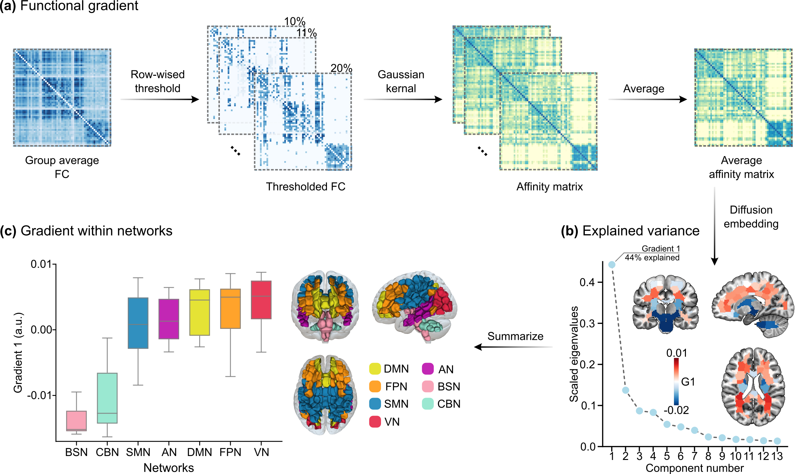

# White Matter Functional Connectivity Gradient

Welcome to the White Matter Functional Gradient package; a companion to our article "Mapping the functional connectivity gradient of the human brain white matter".

Paper link: XXXX

Corresponding author:
XXX

# Data Sources

HCP neuroimaging data (https://www.humanconnectome.org/software/connectomedb)

Neurotransmitter density PET data (https://github.com/netneurolab/hansen_receptors)

AHBA data (https://human.brain-map.org/)

MWMA-200 atlas (https://github.com/Tito11-creater/MWMA) for WM parcellation

# Software Dependencies
MATLAB (tested on R2020a version - https://www.mathworks.com/products/matlab.html)

R (tested on 2023.06.10-524 version - https://dailies.rstudio.com/version/2023.06.1+524/)

# Toolbox Dependencies

BrainSpace (https://brainspace.readthedocs.io/en/latest/) for functional gradients analysis

Metascape (https://metascape.org/gp/index.html#/main/step1) for gene functional enrichment analysis

relaimpo (https://cran.r-project.org/web/packages/relaimpo/index.html) for assessing relative importance in linear models

ITK-SNAP (https://www.itksnap.org/pmwiki/pmwiki.php) for visualizing 3D brain atlas images

slanCM (https://github.com/slandarer/slanColor) for visualizing FC matrices
